# API Docs

Base URL: `https://hospital-segment.onrender.com`

#### Endpoints

Example request route:
`POST https://hospital-segment.onrender.com/caregiver/create`

**Note:** _The participant here is also referred to as the **patient**._

1. **Create caregiver** _POST_ `caregiver/create/`

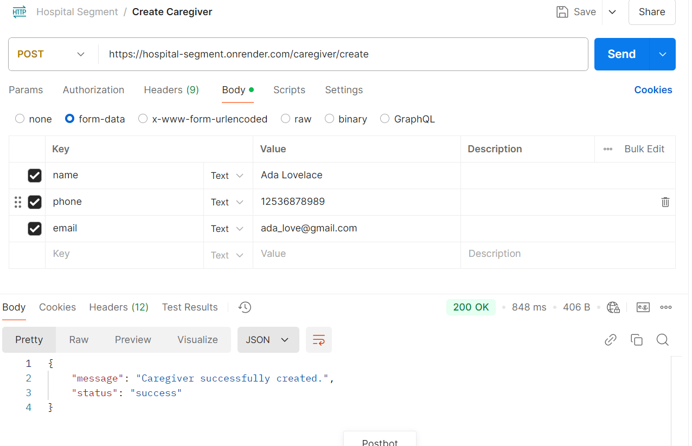

2. **View all caregiver detail:s** _GET_ `caregiver/details`

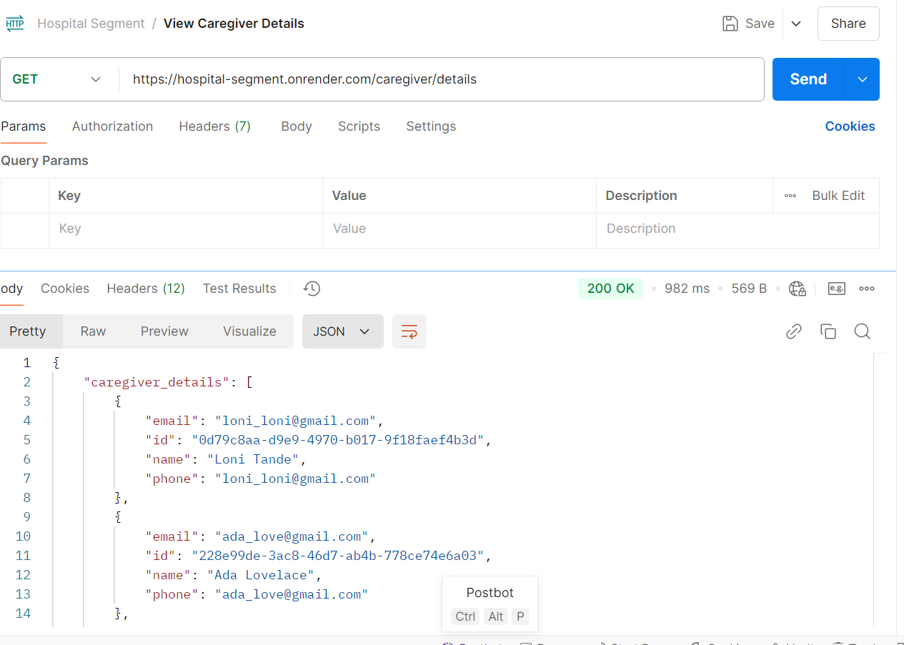

3. **List all participants assigned to a caregiver:** _GET_ `/caregiver/<string:caregiver_id>/participants` 

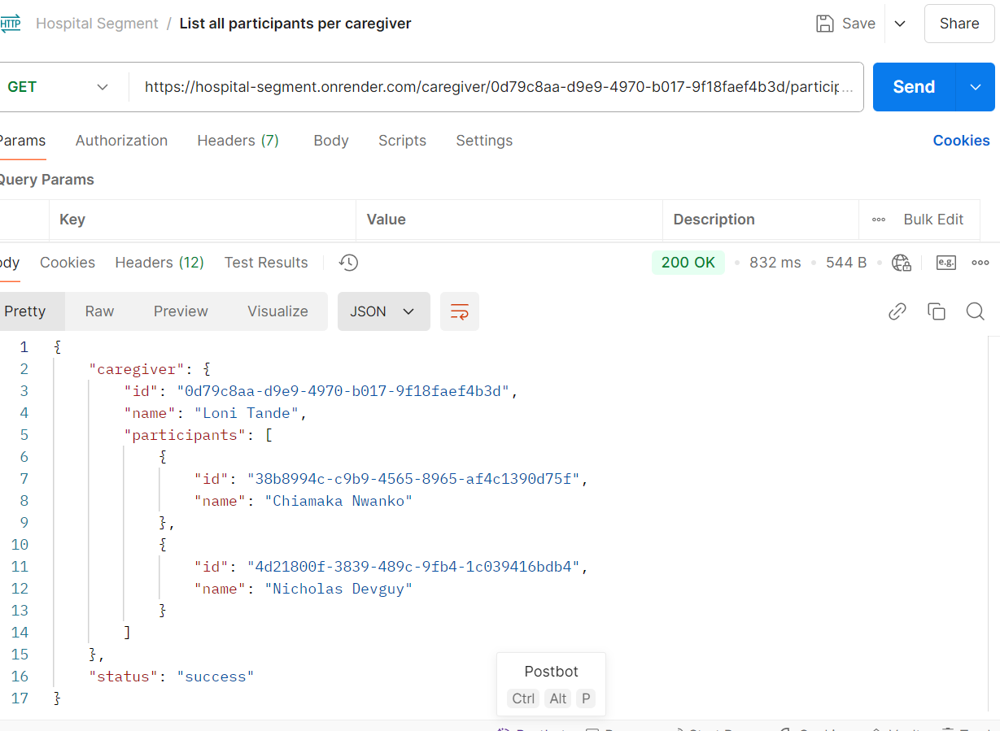

4. **List all prescriptions per participant:** _GET_ `/participant/prescriptions/<string:participant_id>`

**Note:** _action_ is false when a prescription gets created until the administer prescription endpoint is hit.
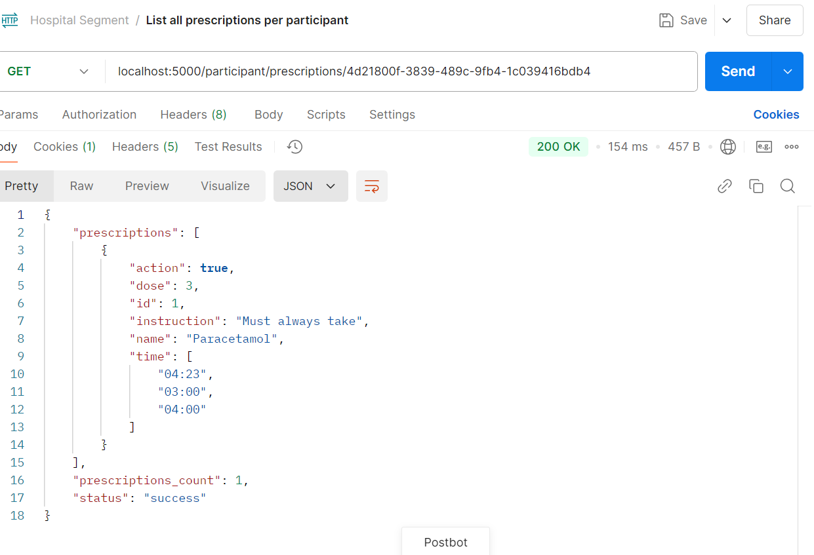

5. **Administer prescription:** _POST_ participant/administer/<string:participant_id>/prescription/<int:prescription_id>

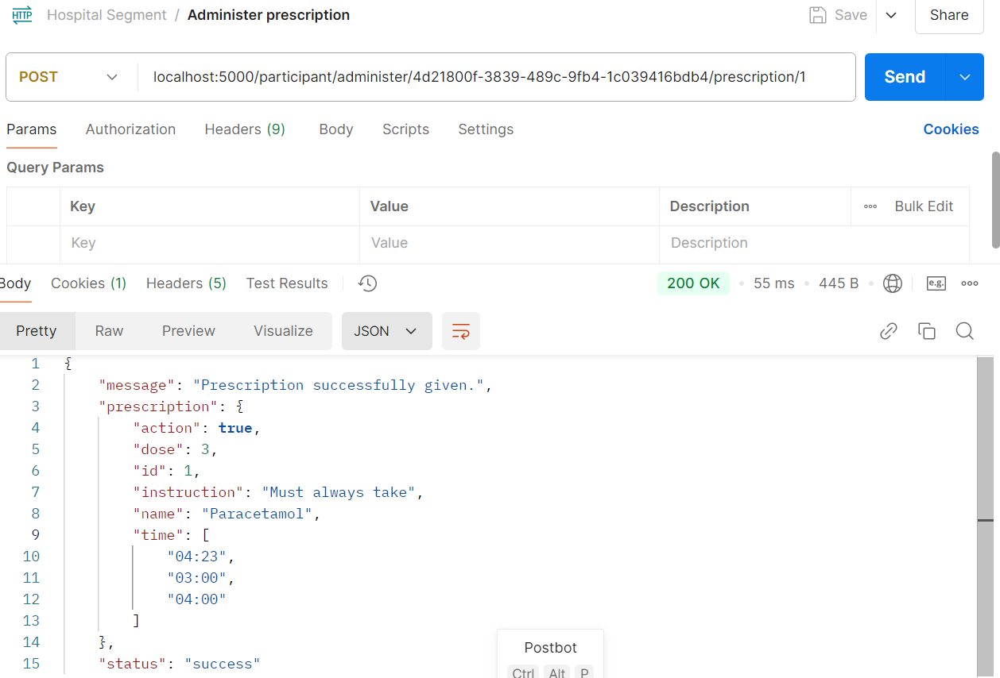

6. **List all drugs:** _GET_ `/drugs`

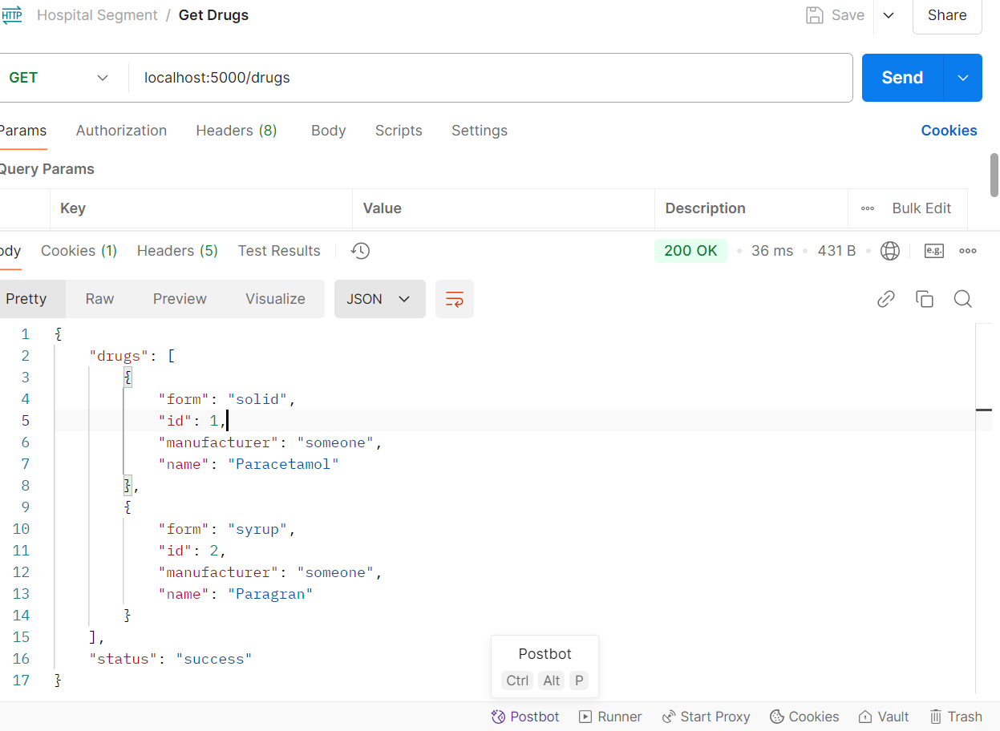

7. **List all pharmacies:** _GET_ `/pharmacy`

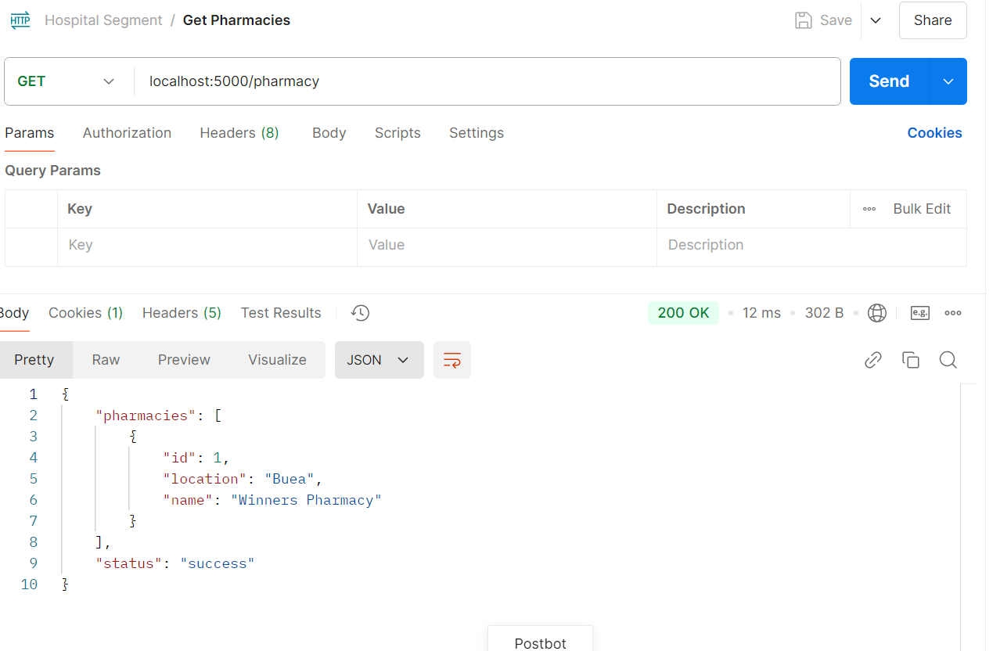

8. **Create participant: ** _POST_ `/participant/create/<string:caregiver_id>`

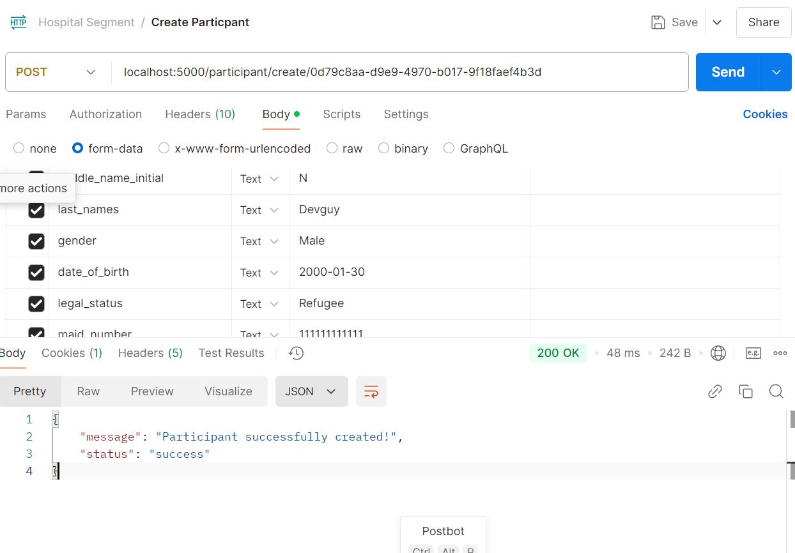

9. **Participant list**: _GET_ `/participant/list`

This lists just the name (first names and last names combined), phone, address, and date of birth of the participant.

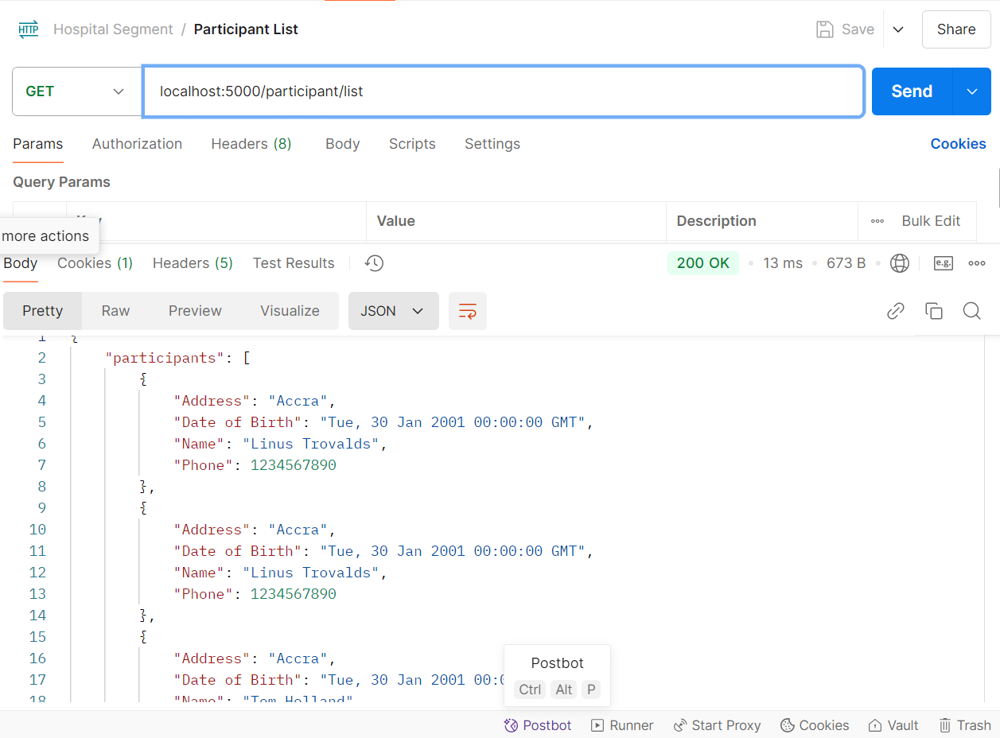

10. **List all participant details:** _GET_ `/participant/details`

Unlike the precious endpoint, this lists the full participant details

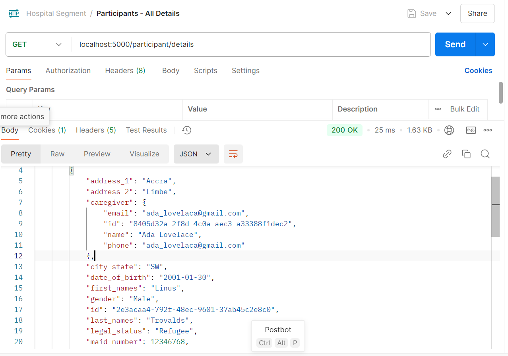

11. **Update participant details: ** _PATCH_ `/participant/update/<string:participant_id>`

**Note:** This is a partial update where can only edit their profile photo, legal status and downwards as per the form
in the design. The first 4 fields cannot be edited.

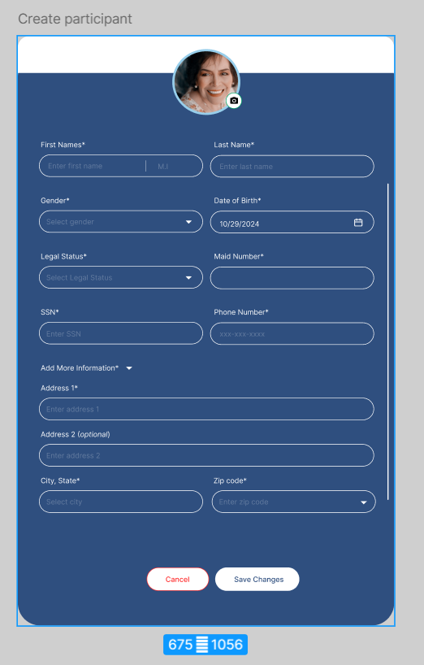

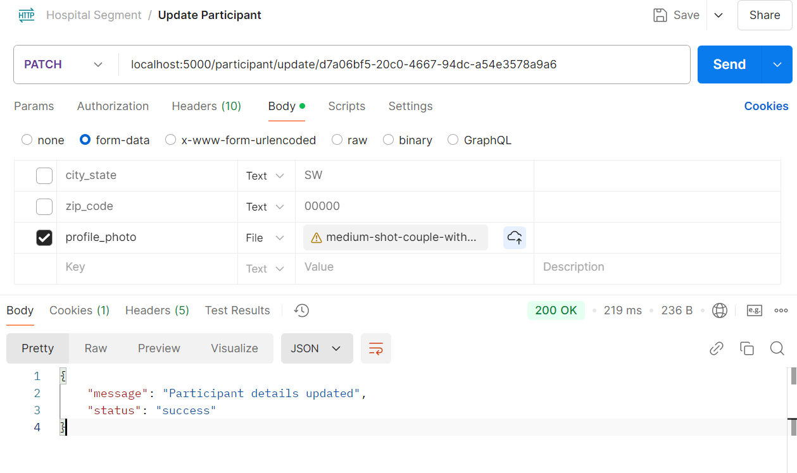

12. **Delete participant:** _DELETE_ `participant/delete/<string:participant_id>`

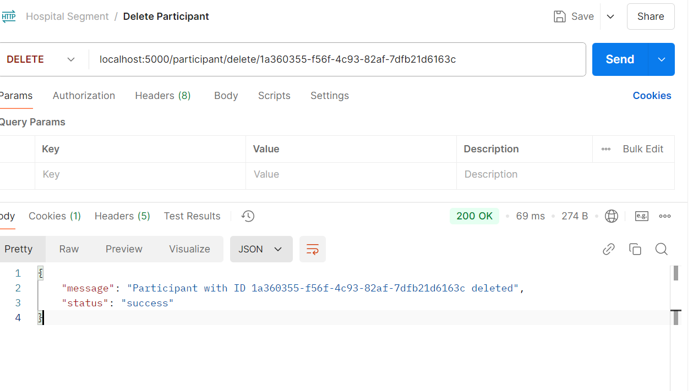

13. **Create prescription: ** _POST_ `/participant/prescribe`

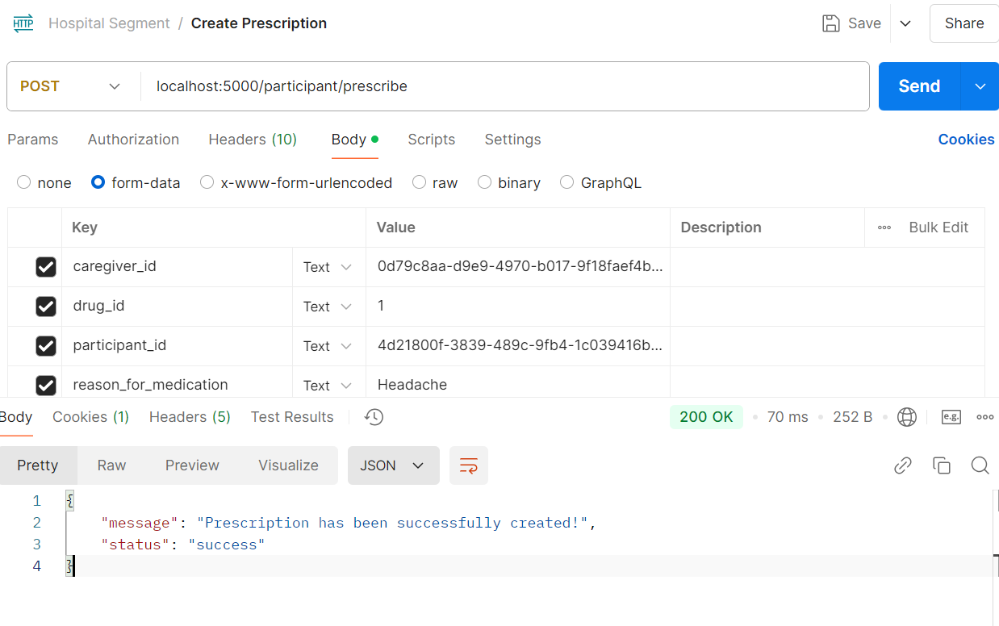

### Test out APIs

To test out the APIs, visit this link to view the [Postman collection.](https://lunar-satellite-35635.postman.co/workspace/My-Workspace~74c77565-9011-4541-82dc-8d69a497f4db/collection/33878300-d1faaabe-c978-4e38-a34e-0956c09b43af?action=share&creator=33878300)
